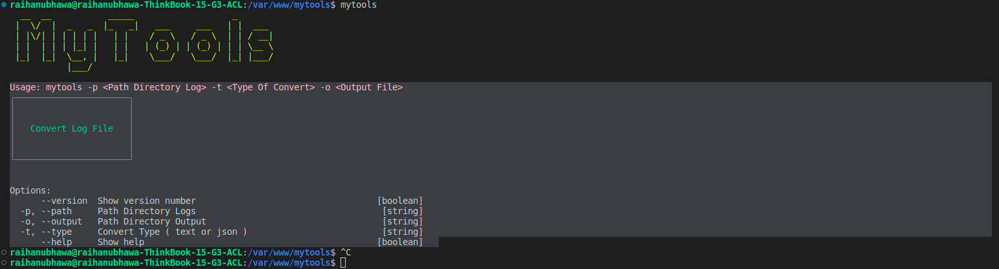

<p align="center">
  
 </p>
 <p align="center">
   
 
   
   
  
 </p>
 <br>
<p align="center">A Sample CLI tool to Convert File Logs</p>
<br>


---

## Usage

```
~$ mytools --help
  __  __           _____                   _       
 |  \/  |  _   _  |_   _|   ___     ___   | |  ___ 
 | |\/| | | | | |   | |    / _ \   / _ \  | | / __|
 | |  | | | |_| |   | |   | (_) | | (_) | | | \__ \
 |_|  |_|  \__, |   |_|    \___/   \___/  |_| |___/
           |___/                                   

Usage: mytools -p <Path Directory Log> -t <Type Of Convert> -o <Output File>
┌──────────────────────┐
│                      │
│                      │
│   Convert Log File   │
│                      │
│                      │
└──────────────────────┘


Options:
      --version  Show version number                                   [boolean]
  -p, --path     Path Directory Logs                                    [string]
  -o, --output   Path Directory Output                                  [string]
  -t, --type     Convert Type ( text or json )                          [string]
      --help     Show help                                             [boolean]
```

<br>

## Installation

1. Clone the repository and then navigate to it.
2. Run ```npm install``` to install the dependencies.
3. Run ```npm install -g .``` to install the CLI. <br>

> :warning: **This might cause an error** which can be resolved easily by using ```sudo``` with the command, **however**, using ```sudo``` with ```npm``` is **not recommended** because it might cause permission issues later. So instead put the code below in your .bashrc file and then run the above command again.
```
npm set prefix ~/.npm
PATH="$HOME/.npm/bin:$PATH"
PATH="./node_modules/.bin:$PATH"
```
4. Now you are good to go and can use the CLI globally!

Type ```mytools``` or ```mytools --help``` to get started.

<br>

## License

MIT © ***MyTools***